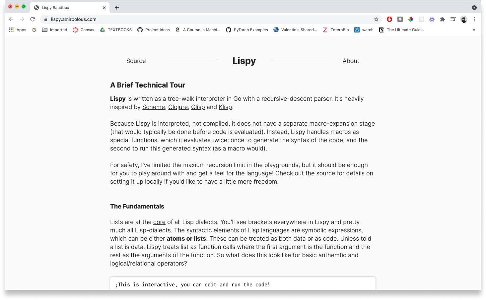

# Lispy ✏️
## Intro

Lispy is a programming language that is inspired by Scheme and Clojure. It's a simple Lisp-dialect I built to better understand Lisp and, more generally, functional programming.

For a journal documenting my process from not knowing what Lisp was, to building this language, refer to this [blog post](https://amirbolous.com/posts/pl) I wrote.

Here's a taste for what it can do


You can tour the language and run it in the browser [here](http://lispy.amirbolous.com/)



You can find the source code for this sandbox [here](https://github.com/amirgamil/lispysandbox).

## What Lispy supports
- [x] Basic arithmetic operations (`+`, `-`, `*`, `/`, `%`, `#`)
    - `(# a b)` means raise a to the power of b
- [x] Relational operators (`>`, `<`, `>=`, `<=`, `=`) and logical operators (`and`, `or`, `not`å)
- [x] Bindings to variables and state with `define`, and `let` for local binding or lexical scope
- [x] Reading input from the user via `readline` and string concatenation via `str`
- [x] Conditionals via `if`, `when`, and `cond`
- [x] Lambdas or anonymous functions via `fn,` functions via `define`
- [x] Reading Lispy code from a file
- [x] Macros (`quasiquote`, threading via `->`. `->>`, and a host of other ones)
- [x] Tail call optimization
- [x] Lists with a core library that supports functional operations like `map`, `reduce`, `range` and several more 
- [x] Hash maps 
- [x] A meta-circular interpreter to run a (more barebones) version of itself at `tests/interpreter.lpy` 


## High Level Overview
Lispy is written as a tree-walk interpreter in Go with a recursive-descent parser. It also has a separate lexer, although most Lisp dialects are simple enough to parse that the lexing and parsing can be combined into one stage.

Because Lispy is interpreted, not compiled, it does not have a separate macro-expansion stage (that would typically be done before code is evaluated). Instead, Lispy handles macros as special functions, which it evaluates twice: once to generate the syntax of the code, and the second to run this generated syntax (as a macro would).

The interpreter code can be found at `pkg/lispy/`, the integration tests can be found at `tests/` and the main Lispy library at `lib/lispy.lpy`. Here's a short sample of lispy in action:

```
(each (seq 18)
    (fn [x] 
        (cond
            (and (divisible? x 3) (divisible? x 5)) "FizzBuzz!"
            (divisible? x 3) "Fizz"
            (divisible? x 5) "Buzz"
            (true) x
        )
    )
)
```


### Under The Hood
Under the hood, Lispy implements a high-level S-expression interface with specific structures to reprsent lists, arrays, symbols, integers, and floats. Lists in Lispy are implemented as linked lists of cons cells, from which we derive the axioms of `car`, `cdr`, and `cons`. Everything else is built on top of these building blocks. Lispy also implements a single environment for variables and functions - it does not keep separate namespaces for them. The environment is the core backbone of the interpreter which allows us to bind values to variables and functions. Lispy uses Go's recursive calls as its native stack and does not implement a separate stack frame. Each function call gets its own environment with a pointer to the parent environment. Most Lispy programs are not going to be incredibly long, thus for the sake of significant speed gains, Lispy copies over all of the data from the parent environment into the current environment. Although this is less memory-efficient and probably would not be used for a production-ready language, it made the interpreter at least 10x faster (instead of having to recurse up to parent environments to resolve a function/variable declaration) when I tested it.

### Lispy Library
Lispy implements a core library (under `lib/lispy.lpy`) that builds on top of the core functionality to offer a rich variety of features.

### Tail call optimization
Lispy also implements tail call optimization. Since Lispy uses Go's call stack and does not implement its own, it performs tail call elimination or optimization similar to [Ink](https://dotink.co/posts/tce/). It does this by expanding a set of recursive function calls into a flat for loop structure that allows us to reuse the same call stack and (theoretically) recurse infinitely without causing a stack overflow.

### Running Lispy
To run Lispy, you have a couple of options.
1. The easiest way is to run it directly in the browser with a [sandbox](http://lispy.amirbolous.com/) I built.  
2. If you want to experiment with it more freely on your local device, you can launch a repl by running `make` in the outer directory
3. If you want to run a specific file, you can run `./run <path/to/file>`. 
- For context, run is an executable with a small
script to run a passed in file. Note don't include the `<>` when passing a path (I included it for clarity).
- You can also add the Lispy executable to your $PATH which will allow you to run `lispy <path/to/file>` in the terminal. If you're on Linux, you can do this with
```
$ make build
$ sudo ln -s <full path to ./lispy> usr/local/bin
```
For context, this creates a symlink (which is just a shortcut or path to a different file) which makes the `./lispy` executable available in your path so you can just use `lispy` instead  `./lispy`

### To Improve
1. Lispy doesn't handle errors very gracefully, especially in the code sandbox. It's also less strict about code that is incorrect in some way or another, meaning it may still run code that should probably raise an error.
2. Lispy could probably be a little bit faster with a couple more optimizations, but it's already surprisingly fast. As proof, try running `tests/test4.lpy` :) I think the speed is more indicative of how far modern computers have come than brilliant language design by me.

### Helpful Resources 
There were many resources that proved to be invaluable over the course of this project. Here's a short snippet of them:
1. [Glisp](https://github.com/zhemao/glisp/)
2. [Clojure](https://clojure.org/) 
3. [Scheme](https://www.scheme.com/tspl4/)
4. [Klisp](https://github.com/thesephist/klisp/tree/main)
5. [Structure and Interpretation of Computer Programs](https://web.mit.edu/alexmv/6.037/sicp.pdf)
6. [Mal](https://github.com/kanaka/mal)
7. [Lisp in Python](http://norvig.com/lispy.html)
8. [On Lisp](https://sep.yimg.com/ty/cdn/paulgraham/onlisp.pdf?t=1595850613&)
9. [Crafting Interpreters](http://craftinginterpreters.com/)
