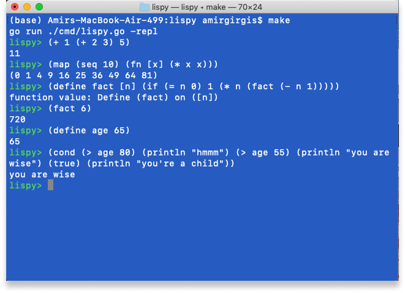

# Lispy ✏️
## Intro

Lispy is a programming language that is inspired by Scheme and Clojure. It's a simple Lisp-dialect I built to better understand Lisp and, more generally, functional programming. [Here](https://maryrosecook.com/blog/post/a-practical-introduction-to-functional-programming) [are](http://www.paulgraham.com/onlisptext.html) [some](https://github.com/thesephist/klisp) [great](http://craftinginterpreters.com/) [resources](https://github.com/zhemao/glisp/) I used to figure things out. 

For a journal documenting my process from not knowing what Lisp was, to building this language, refer to this [blog post](https://amirbolous.com/posts/pl) I wrote.

Here's a taste for what it can do



What Lispy supports
- [x] Basic arithmetic operations (`+`, `-`, `*`, `/`, `%`, `#`)
    - `(# a b)` means raise a to the power of b
- [x] Relational operators (`>`, `<`, `>=`, `<=`, `=`) and logical operators (`and`, `or`, `not`å)
- [x] Bindings to variables and state with `define`, and `let` for local binding or lexical scope
- [x] Reading input from the user via `readline` and string concatenation via `str`
- [x] Conditionals via `if`, `when`, and `cond`
- [x] Lambdas or anonymous functions via `fn,` functions via `define`
- [x] Reading Lispy code from a file
- [x] Macros (`quasiquote`, threading via `->`. `->>`, and a host of other ones)
- [x] Tail call optimization
- [x] Lists with a core library that supports functional operations like `map`, `reduce`, `range` and several more 
- [x] Hashmaps 

## High Level Overview
Lispy is written as a tree-walk interpreter in Go with a recursive-descent parser. It also has a separate lexer, although most Lisp dialects are simple enough to parse that the lexing and parsing can be combined into one stage.

Because Lispy is interpreted, not compiled, it does not have a separate macro-expansion stage (that would typically be done before code is evaluated). Instead, Lispy handles macros as special functions, which it evaluates twice: once to generate the syntax of the code, and the second to run this generated syntax (as a macro would).

### Under The Hood
Under the hood, Lispy implements a high-level S-expression interface with specific structures to reprsent lists, arrays, symbols, integers, and floats. Lists in Lispy are implemented as linked lists of cons cells, from which we derive the axioms of `car`, `cdr`, and `cons`. Everything else is built on top of these building blocks. Lispy also implements a single environment for variables and functions - it does not keep separate namespaces for them. The environment is the core backbone of the interpreter which allows us to bind values to variables and functions. Lispy uses Go's recursive calls as its native stack and does not implement a separate stack frame. For simplicty, it also does not keep distinct stack frames for each function call, instead copying over all of the data from the parent environment into its current environment. Although this is less memory-efficient and would not be used for a production-ready language, it worked well enough for this project.

### Lispy Library
Lispy implements a core library (under `lib/lispy.lpy`) that builds on top of the core functionality to offer a rich variety of features.

### Tail call optimization
Lispy also implements tail call optimization. Since Lispy uses Go's call stack and does not implement its own, it performs tail call elimination or optimization similar to [Ink](https://dotink.co/posts/tce/). It does this by expanding a set of recursive function calls into a flat for loop structure that allows us to reuse the same call stack and (theoretically) recurse infinitely without causing a stack overflow.

### Running Lispy
To run Lispy, you have a couple of options.
1. The easiest way is to run it directly in the browser with a [sandbox](http://lispy.amirbolous.com/) I built.  
2. If you want to experiment with it more freely on your local device, you can launch a repl by running `make` in the outer directory
3. If you want to run a specific file, you can run `./run <path/to/file>`. 
- For context, run is an executable with a small
script to run a passed in file. Note don't include the `<>` when passing a path (I included it for clarity).
- You can also add the Lispy executable to your $PATH which will allow you to run `lispy <path/to/file>` in the terminal. If you're on Linux, you can do this with
```
$ make build
$ sudo ln -s <full path to ./lispy> usr/local/bin
```
For context, this creates a symlink (which is just a shortcut or path to a different file) which makes the `./lispy` executable available in your path so you can just use `lispy` instead  `./lispy`


- Define new bindings to variables and functions with a universal keyword
`(define a 5)`
`(define function [name] () `

- Lists (in particular) and arrays are implemented as array under the hood for simplicity (as opposed to a List being implemented as a linked
list of cons cells in most Lisp dialects)


There is no distinction between statements and expressions -> everything is an expression! A function declaration will return the name of the functiion. A function will return the last expression of the body.


#### Bindings via define
Bindings to variables and functions in Lispy are done via the keyword define
```
lispy> (define a 5)
#user/define
lispy> a
5
```

#### Conditionals via if
Conditionals are handled with if statments that follow this pattern
```
(if (cond) true false)
```
True and false are S-expressions. For example
```
(if (>= age 20) (println "You're no longer a kid :(" ) (println "hell yeh, you living the good life"))
```

#### Functions
Function bodies in Lisp consist of one Sexp. For example, this would throw an error. Parameters are passed via square brackets.
```
lispy> (define doMultipleThings [x] 
                (+ x x)
                (- x x)
        )

```

If you'd like to execute multiple expressions, wrap it in a do statement like this

```
lispy> (define doMultipleThings [x] 
                ( do
                    (+ x x)
                    (- x x)
                )
                
        )

```
Naturally, recursion follows from this definition nicely, so we can define a recursive function like this
```
lispy> (define fact [n] (if (= n 0) 1 (* n fact(- n 1))))
#user/fact
lispy> (fact 4)
24
```

Note, to differentiate functions from variables since both use the `define` keyword, you should always have square brackets `[]` after the function name even if it takes no parameters. 
```
lispy> (define noParams [] 
                ( do
                    (+ 1 1)
                    (- 1 1)
                )
                
        )
lispy> (define manyParams [a b c] 
                ( do
                    (+ a b)
                    (- b c)
                )
                
        )

```

#### Quotes
Define quotes in Lispy with the `'` 
```
lispy> '(1 2 3)
(1 2 3)
lispy> 'atom
atom
```

Remember () = call to function, so when passing to cons, car, cdr, make sure you have a quote


